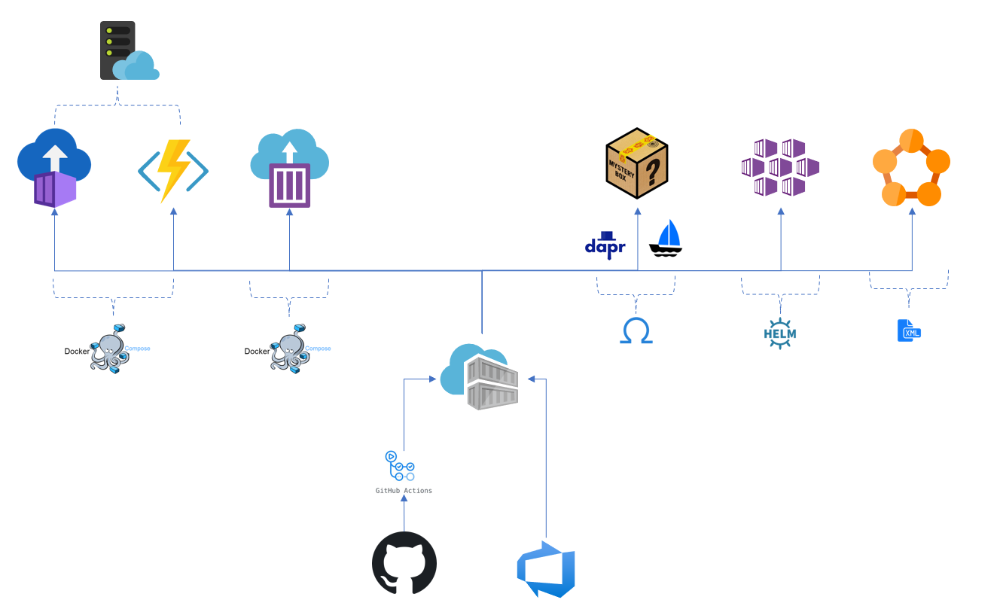

# Orchestrated containers, meets PaaS and Serverless

*In [a brief look into the future, guided by dapr](azure_containers.html) speculation about the future for containers in Azure used dapr (v0.9-time frame) as a guiding light. In this article the future of PaaS is put under scrutiny.*

Orchestrator like Kubernetes has been the go-to infrastructure for handling more complex workloads.
Utilizing compute more evenly in cluster(s), scaling per unit. But this comes with some operational complexity. Different flavors of hosted orchestrator(s) is in every major cloud providers offering.

We also see orchestrator apis added on top of serverless infrastructure, to enable a elastic serverless cluster(s).

This eases some aspects of running applications in clusters, but the deployment and management of the orchestrator still remains.

This is where projects like [OAM (open application model)](https://oam.dev) comes in. Through a developer centric model, it abstracts the underlaying orchestrator expressing capabilities (traits) and application in one model.

This makes it possible to have one application centric model on top of different services.

In the Kubernetes case this is realized through [KubeVela](https://kubevela.io/), a Kubernetes plugin that uses OAM for deployments and enables an application centric PaaS way of deploying to Kubernetes.
This lets the "PaaS" be flexible, since it could add and express underlaying capabilities of the platform as traits.

Autoscaling could one area that could be extended and exposed as traits. Event driven autoscaling through [KEDA](https://keda.sh/) is a possability.

To further add to the mix, let's say that [dapr](https://dapr.io) is installed in the cluster. Dapr could then be exposed as traits in the OAM model. Making the PaaS "daperized".

Now imagine all of this as a cloud offering!

*(Dapr support in KubeVela is target for its 1.1 release.)*

### Azure

Following image is to compare and illustrate this scenario with Azure offerings with containers as deployment;

All share the deployment option - from container registries, in this image the Azure Container Registry.

- Azure web apps for containers and Azure functions support docker compose (limited) for deployment. They use service plans for container compute/placement with "auto-scaling support". They also share first party git hub action for deployment.
- Azure container instances (ACI) have richer docker compose support, and different models for compute utilization/lifetime. But without "auto-scaler".
This service is utilized for ["virtual nodes"](https://docs.microsoft.com/en-us/azure/aks/virtual-nodes), where Kubernetes API is added on top of this serverless offering.
- Azure Kubernetes Service (AKS) is a hosted Kubernetes service. Dapr and other options is also installable in this service. 
- Service Fabric has its own deployment manifest, but also programing models for stateful services (with service registry support). Dapr will be supported (in the future).
- The "mystery box" is the imagined service.

