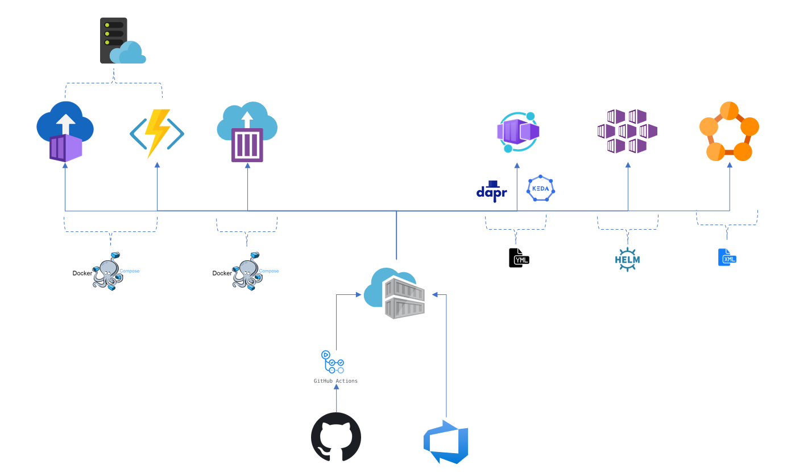

## Dapr - Serverless Services

### Trend Alignment
In Q2 the InfoQ trend graph placed Dapr in the innovator column. A lot have happened since. Dapr is now at version 1.5 - [Dapr 1.5](https://github.com/dapr/dapr/releases/), and has joined CNFC - [Dapr joins CNCF Incubator](https://www.cncf.io/blog/2021/11/03/dapr-distributed-application-runtime-joins-cncf-incubator/). There has also been a focused conference - [DaprCon](https://blog.dapr.io/posts/2021/10/21/thanks-for-a-great-first-daprcon/).
It will be interesting to see if Dapr moves on next years trend graphs. You'll find case studies as a part of DaprCon.

/filters:no_upscale()/articles/architecture-trends-2021/en/resources/1Architecture-2021-1618415938711.jpg)

### Azure Container Apps
In November, during Ignite 2021 a new Azure service was announced - [Azure Container Apps](https://azure.microsoft.com/en-us/services/container-apps/).

In prior posts we covered Azure services with container support, with wishful thinking around a new service incorporating open source projects to make Kubernetes more developer friendly.

We could now see Azure Container Apps starting to fulfill this spot, starting with Serverless Container Apps (Kubernetes), Dapr integrated and scaling through Keda. Maybe this will grow and incorporate OAM and KubeVela as well in the future ?

Services like this will affect Dapr usage and adoption, making it more accessible. This also moves container apps and Dapr closer adoption, and thus might be worth looking into more closely, during preview.

