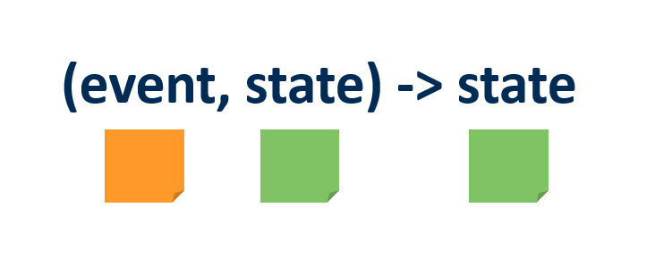
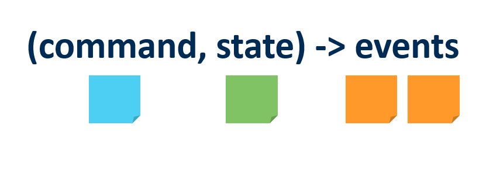
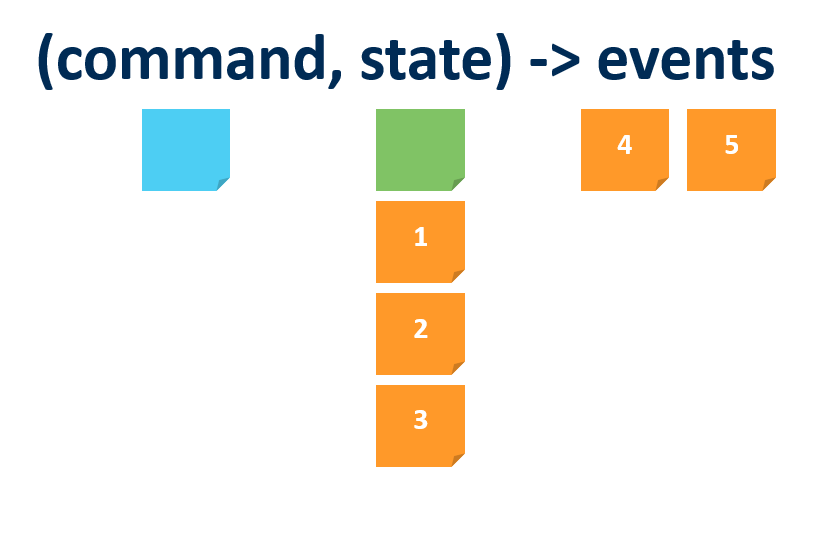
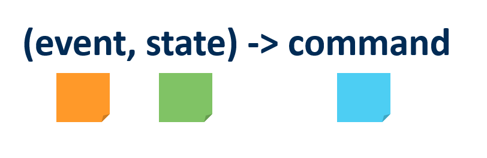

# Day One

## Domain Event
"A Domain Event is the main concept of EventStorming. It is an event that is relevant for the domain experts and contextual for the domain that is being explored. A Domain Event is a verb at the past tense. The official EventStorming colour is orange."

## Command/Action
"Represents decisions, actions or intent. They can be initiated by an actor or from an automated process. During process EventStorming usually, the word Action first better with stakeholders than command. We officially use a blue coloured post-it for it."

## Policy

"In essence, a policy is a reaction that says “whenever X happens, we do Y”. Eventually ending up with in the flow between a Domain Event and a Command/action. We use a big lilac post-it for these. A policy can be an automated process or manual. A policy can also be named a reactor, eventual business constraint or rule or a lie detector because there is always more to policies than you first think."

Resources
 - [EventStorming; Core concepts, glossary and legend](https://baasie.com/2020/07/16/eventstorming-core-concepts-glossary-and-legend/)

