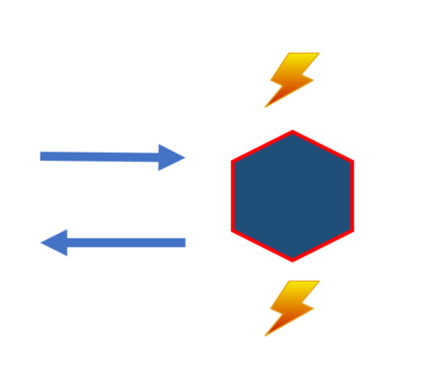
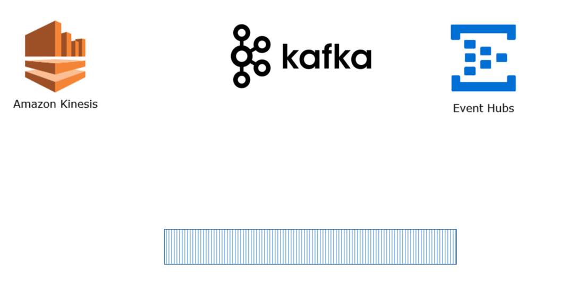
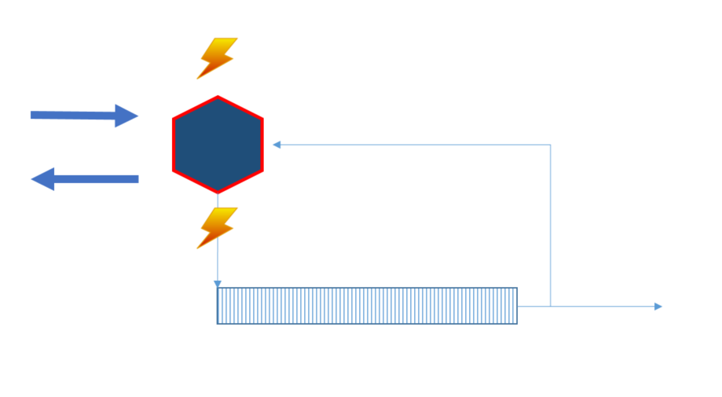
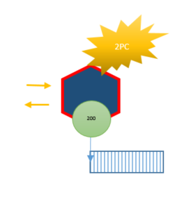
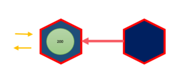
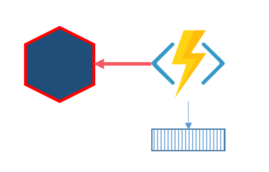
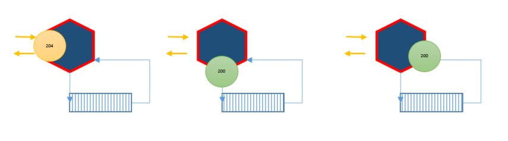

# Event driven architecture

By Per Ökvist ([@per_okvist](https://twitter.com/per_okvist/)) 
Please give feedback and report issues on the [GitHub repository](https://github.com/perokvist/event-driven-architecture/).

## Introduction

This is a follow-up to the talk [Practical experiences with microservices in the cloud](https://www.slideshare.net/Perkvist1/practical-experiences-with-microservices-in-the-cloud) I held at the Micro CPH 2017.

In this article we'll explore Event Driven Architecture (EDA) mainly through "Event-based State Transfer", see [Martin Fowler's event patterns](https://martinfowler.com/videos.html#many-meanings-event). In the examples services and compontents will collaborate through events. The service and component definition we're using is as follows.
## Service / Component

Each service can react to / emit events, and handle request/response.
Requests can be commands or queries. Responses can be only status codes or results, the request/response could by synchronous or asynchronous, eventual consistent or not. While the service definition stays the same, all these options are implementation details.

[Source of inspiration](http://media.abdullin.com/blog/2015/2015-03-18-edd-eBay-Barcelona.pdf#page=23)

## Logs

This article will also look at integration between services using logs.

Logging is characterized as **append only**, **ordered events** (within a partition) and **offsets**, and could easily be compared to a file(s). Logs are pushing position and acknowledging/"checkpointing" to the clients, removing broker concepts, centralized subscriptions and deadletter etc., all reducuing complexity compared to queue and broker systems.

Using logs as integration or/and as a form of persistant model introduces new patterns when working with events. These options are going to be explored further in this article.

## Method one: Two-phase commit (2PC)

A common challenge when emitting changes as events is to drive the local state and publish the events in a "safe" manner. If the service updates local state first in one transaction and then writes the events to a log or a broker in another transaction, you have to deal with two transactions. Therfore you need a [two-phase commit](https://en.wikipedia.org/wiki/Two-phase_commit_protocol) to guarantee not loosing data/events.

Only if both transactions complete successfully can we return 200 OK to clients. Otherwise we have to rollback transactions or data can end up in an inconsistent state. If this has business implications we would like to remove this complexity.

## Method two: Polling

Another variant is to poll the source of events. This allows local state to be written, but the producing service doesn't publish the events. Instead the consumer polls based on time or offset. The consumer keeps track of the time or offset that is last polled from the producer. This variant introduces coupling between producer and consumer, as well as potential global offset for the producer, and increased traffic.

## Method three: Single publisher

This variant has a lot in common with polling. Here a publisher does the polling and then publishes the events. But due to the fact that the publisher needs to keep track of the offset and publish the events, two-phase commit challenges come back and the implication is often that the same event could be published twice.

## Method four: Log subscription

In this variant we only write to the log, and then read the log to update local state. This way we only have one transaction when writing to the log.
This have similarities with using logs to avoid dual writes as detailed in [Kafka dual writes](https://www.confluent.io/blog/using-logs-to-build-a-solid-data-infrastructure-or-why-dual-writes-are-a-bad-idea/).

This variant also has a lot of tweaks how we could respond to commands from http requests. We could hide the async implementation or embrace it.

### 4.1 
We could expose our async implementation by responding 204 No Content when we receive the command.
To guarantee processing, we need to persist (enqueue) the command, or send 204 No Content after appending to the log.

### 4.2
We could return 200 OK (or 204 No Content), when we have written to the log.

### 4.3 
We could wait and return 200 OK when we have updated the local state. This also gives us an option to return the result.

### Concurrency
Responding to the client is one thing, but what about multiple commands targeting the same instance? This also is an implementation detail, but if the use case needs it, we could use locks to serialize execution. In the response scenario 4.3 above we use the same lock to determine when we complete.

## Method five: The truth is the log. The database is a cache

This is a quote from Pat Helland's paper ["Immutability Changes Everything"](http://cidrdb.org/cidr2015/Papers/CIDR15_Paper16.pdf) and is exemplified in ["From Microliths To Microsystems"](https://www.slideshare.net/jboner/from-microliths-to-microsystems).

The final variant is to treat the log as our database. This could be done using "infinite" retention (Kafka only) or some form of snapshoting, preferably [Log Compaction](https://www.linkedin.com/pulse/kafka-architecture-log-compaction-jean-paul-azar) (Kafka only). Then all other representations of the current state are views/projections or cache of the current state.

### Idempotency

Due to the fact that events are ["Event-based State Transfer"](https://martinfowler.com/videos.html#many-meanings-event) events, not [Conflict-free replicated data type (CRDT)](https://en.wikipedia.org/wiki/Conflict-free_replicated_data_type) events and common infrastructure is at-least-once delivery, idempotency on the consumer side becomes important as do order.

Some of the variants above also push "problems" to the consumer side, like updating local state and manage checkpointing. This could also introduce 2PC, but in worse case, handle/receive the same event more than once.

### Scaling writes

All scenarios above assume that "local state" is on one node. When scaling in a way that sets of instance state are located on different nodes, incoming traffic needs to be delegated to the node that owns the target state. The partitioning could then also be shared by the log, but doesn't need to (if filtered). Some variant of 4.X would not be suitable when scaling writes.

## Event sourcing

If local state is persisted, *how* is an implementation detail. Keeping a stream of events per instance (aggregate) as the source of state is often refered to as Event Sourcing. Often tied to using Domain Driven Design (DDD). DDD is not required for the patterns above but might be a good fit, same applies to event sourcing.

 

Outside of DDD, this stream of events could be refered to as a journal or log. The terms journal, log and streams are found in both event sourcing and stream processing (logs).

## Logs - bigger picture

Using logs for integration or backbone for your data platform has been described in many different ways. Fred George described it as ["Rapids, Rivers and Ponds"](https://vimeo.com/79866979). When all events are published to the rapids, contexts or services could subscribe and filter events through rivers. Local state or storage of filtered events becomes local ponds.

More on event collaboration over different context trough a backbone of events can be found in the blog post ["Build services backbone events"](https://www.confluent.io/blog/build-services-backbone-events/).

Looking back at our service/component definition we can compare that to one case of stream processing, where we have a consumer reading from one stream and publishing result on "another" (possible the same) stream.

In this stream processing scenario we see similarities to a service that  consumes events and thereafter produces new events. This could be an [enricher](http://www.enterpriseintegrationpatterns.com/patterns/messaging/DataEnricher.html) scenario.

Kafka being the log with the largest community and tooling around it, has some utils like [Kafka streams](https://balamaci.ro/kafka-streams-for-stream-processing/) making consuming events easier.

### Integration through logs

One other way of integration with logs, is to publish changes from a database as events, turning the database inside out. This enables subscription of change through CRUD events. An example of this is [Bottled Water: Real-time integration of PostgreSQL and Kafka](https://www.confluent.io/blog/bottled-water-real-time-integration-of-postgresql-and-kafka/).

This could inspire a variant when an ORM publishes changes (possible 2PC).

Some drawbacks of this integration style are schema leakage, missing intent and pushing some business rules to consumers.

## Modelling

When collaborating through the use of events, events become the starting point for discussion and modelling. [Event storming](http://eventstorming.com/) is a way of driving your design from events in a non techinical manner.

This will also aid you in finding the boundaries for service/components (context) (out of scope of this article).

It's one thing to start fresh, but learning your domain is constant learning, finding the best feedback loops. When iterating over your contexts, things will change and versioning our events comes in plan, see [Versioning in an Event Sourced System](https://leanpub.com/esversioning) and [The elephant in the room](https://skillsmatter.com/skillscasts/9652-the-elephant-in-the-room) (video).

Modelling - [Top domain model](https://blog.scooletz.com/tag/top-domain-model/)

### Log vs Database

Some databases offer subscription of changes, like [EventStore](https://geteventstore.com/). This achieves the goal of a single transaction, due to writing to the stream is the only transaction. Subscribers then retrive changes through a subscription model of given streams. The streams in the eventstore is both the persistance and the queue in this case, tying integration to the "database".
In this scenario read side (projections) could read the same stream as the write side, making changing events a bit easier.  

The are other stores offering similar solutions.

This scenario ties all services to the persitance of events (the database), and possible tooling for subscription is often tied to appication code. See [Greg Young - Polyglot Data](https://www.youtube.com/watch?v=GbM1ghLeweU)

This kind of subscription model could also be used to create a single publisher (method three).

---

Some details about [implementation](implementation.html).

### Thanks
Thanks to; [Niklas Rothman](https://github.com/nironixon),  [Kristoffer Jälén](https://github.com/kristofferjalen), [Daniel Wallin](https://github.com/dawallin), [Marcus Widblom](https://github.com/f00), for the feedback. 
