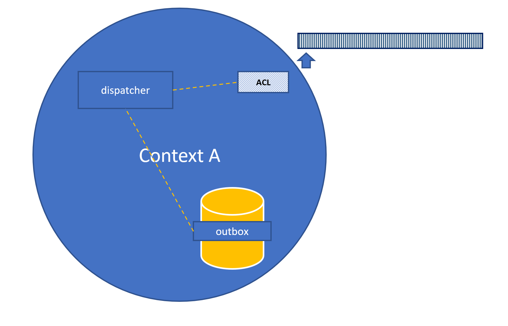

## Communication between contexts

When driving processes or passing information between contexts, what kind of events are we sending between services?
It easy to assume that if Context A is using events to drive its internal state, that we just publish these side effects to the rest of the world. This might solve building a model for read or trigger some process in another context, but quickly gets to granular and volatile. Informing the rest of the world with a business related events is often a better fit.

*Here we call side effects - domain events, and the public event(s) integration events.*

A change in context A is triggered and event(s) created. State is updated and events are put in the outbox, in the same transaction. 

The contents of the outbox could then be pulled and published as messages. When successfully published they are removed from the outbox.
Upon failure, they could be retried or the outbox could be processed later (interval/startup).

If the event in the outbox is not stored as an integration- event an ACL might build an integration-event on publishing.

The consuming context puts messages of interest in its inbox, from there they will be dispatched. On it's way it might be transformed by an ACL to fit the context. This depends on the kind of relationship between the contexts.

        
When using an EventStore, the outbox might not be needed, the dispatcher could subscribe to changes or pull the "all" stream or equivalent. 

---

**Note** The example above does't imply usage of DTC. Just some form of implementation of the outbox pattern.

---

### Resources

* [Domain events vs event sourcing](https://www.innoq.com/en/blog/domain-events-versus-event-sourcing/)