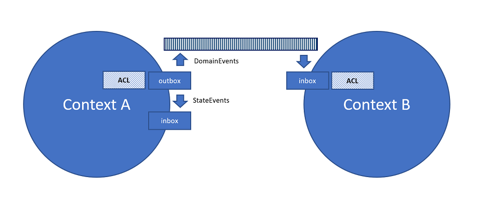

# Communication between contexts

When driving processes or passing information to build read models between contexts, what kind of events are we sending between services?
It easy to assume that if Context A is using events to drive it internal state, that we just publish these side efftect to the rest of the world. This might solve building a model for read or trigger some proccess in another context, but quickly gets to granular and volatile. Informing the rest of the world with a business realted events is often a better fit.

*Here we call side effects/state transfer events just statevents, and the public event of our domain domain events.*

A change in context A is triggered and event(s) created. After writing them to a local stream (ES), they are put in an outbox, in the same transaction. The outbox is then check to see if there is something we want to share with the world, a domain event. If so it's published, if not it's move to the inbox. Both the outbox and inbox are persisted queues owned by the context. The inbox is then read to dipatch events within the context. If a change is of value to rest of the world, a domain event might be crated by some ACL then but in the outbox and dispatched out from the context.

The consuming context puts messages of interest in it's inbox, from there they will be dispached. On it's way it might be transformed by an ACL to fit the context. This depends on the kind of relationship between the contexts.

### Resources

* [Domain events vs event sourcing](https://www.innoq.com/en/blog/domain-events-versus-event-sourcing/)