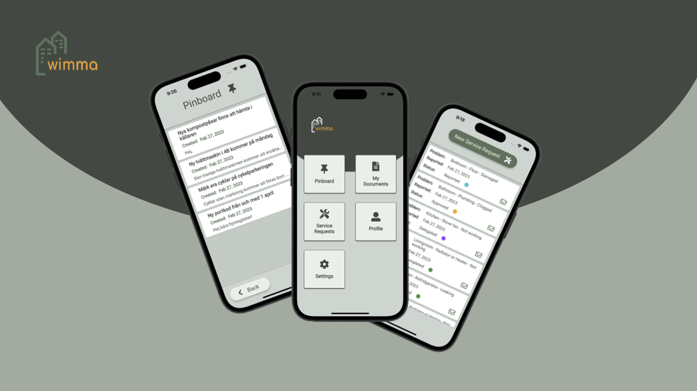
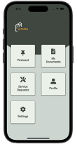
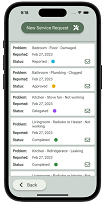
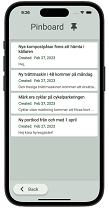
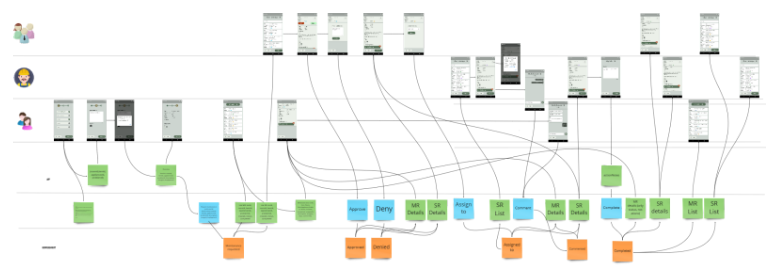
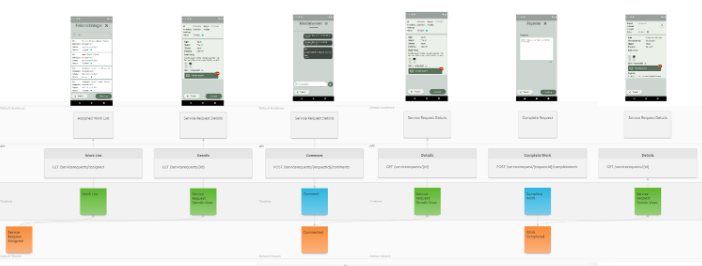

# Wimma Case - Events
## *“Event utilization in the startup world”*

[Wimma](https://www.wimma.se/) is a startup in prop-tech, building an app to aid communication between landlords, caretakers and tenants, targeting smaller real estate companies.
Wimma has a mobile app consisting of several modules like notice board and service requests.
 
In this article we’re going to focus on the service request module, and how events are used throughout the process.

There are many ways of using events in discovery, exploration and collaboration. Everyone understands (business) events, and their position on a timeline. An excellent opportunity to reach a shared understanding among different traits. A common practice/workshop format is eventstorming, introducing a notation, easy to use with colored post-its, where a foundation of orange stickers (events) is placed on a timeline. Eventstorming could be seen as a framework you could build upon. Event modeling is another tool that shares some of the notations.

In the context of the service request module, events could be *RequestApproved*, *RequestAssigned* etc. 

## Event modeling
Early on after some initial validation and mock-ups, event modeling was introduced as the team's collaboration model.
Event modeling is driven by screens or automation, with audiences in swimlanes, where data on screen(s) (view/read-model) are green, interaction (commands) blue and side effects - events are orange. Events are also placed in swimlanes to identify streams/boundaries, while the green and blue shares a swimlane for interaction and relations. - [eventmodeling.org](https://eventmodeling.org/)

> *An example of an early event model Miro board.*

After a few iterations of modeling the event model became a living blueprint (shared understanding) for the team to start development, with the addition of an api endpoints swimlane to the event model.

In later stages an event modeling tool - oNote was introduced and evaluated, that brought a more formal representation over miro. We ended up using both together.

> *An example of an event model with oNote screen(s) and UI screens in Miro.*

 > ”To work with event modeling through the Miro board was extremely useful for us. It allowed the team to have an overview of the applications functionality and the content of every screen. It was also convenient to have the Miro board as a blueprint when starting the development and be in sync with the team when changes were made.” - **Clara, Designer @ Wimma**

## Building on history of events
When using an event centric modeling tool, there are few options on making events a first class citizen in the implementation. In the case of service requests we choose to store all events that occurred and evolve  the application state (transactional/operational) from past events - event sourcing. This allows us to; 
- Keep history / show full history (track requests)
- Time based KPIs (temporal)
- Project different models from history (service request -> work order)

#### History of a request
With all historical events on a given service request, we could easily create views with the right level of detail  for different audiences about the request process.
### Time based KPIs
Since all events are stored with the time they occurred, we based on the full history could calculate different time based KPIs, like average lead time between states, ex from Registered request to assigning, or from assigning to completion etc.
#### Project different models
Depending on state and audience the history could be projected into model(s) suiting each case. It could be as a work order with other details for employees or a Service Request catered for tenants.

Commonly when an application changes state (update) it replaces its current state. Here we’re collecting all events that happen and store that history, and evolve the application state from that.

In the event modeling models, we see the relationship between interaction (commands, blue) and how the application decides which events it might result in, and how events then have an effect on the application state is presented (views/read models, green).  

### Lifetime
Throughout the lifetime of an “request” - maintenance request -> service request -> work order, the “request” enters different states that could be represented by different models.
In the case of the service request module, we choose to store all history for a “request” in one timeline(stream) per request, since it has a shared lifetime, and project different models for different states. The option of different projections of state caters to different UI screens, but also gives us the possibility to use different models when implementing business logic.

## Closing
Hope this gives a glance into how events could be utilized in collaborative efforts as well as in implementation, in a smaller product. 

As always, having a shared understanding between traits is key. 

  

